# Trainerlink

<h2>Description</h2>
Trainerlink is a Java-based Android mobile app designed to connect fitness trainers with clients. I have developed the app from the client end only as it is a prototype. The app allows users to search for trainers by location and specialisation, view detailed trainer profiles with reviews, book training sessions with integrated payment via Stripe, chat directly with trainers, and manage their bookings. It also features Google Fit integration for workout tracking.
 

<h2>Technologies Used</h2>
- <b>Java (Android Studio)</b> 
- <b>Firebase Authentication</b> 
- <b>Firestore Database</b> 
- <b>Stripe API</b> 
- <b>Google Fit API</b> 
 

<h2>Environment Used</h2>
- <b>Android Studio</b> 
- <b>Firebase Console</b> 
- <b>Google Cloud Platform</b>
 

<h2>Key Features</h2>
<ul>
  <li><b>User Authentication:</b> Secure login using Firebase Authentication</li>
  <li><b>Search and Filter:</b> Search trainers by location and specialisation with sorting options</li>
  <li><b>Trainer Profiles:</b> Detailed profiles with photos, specialisations, descriptions, and reviews</li>
  <li><b>Booking System:</b> Select date/time, pay securely via Stripe, and receive booking confirmation</li>
  <li><b>Chat Functionality:</b> Chat simulation between user and trainers</li>
  <li><b>Booking Management:</b> Users can view and delete their bookings</li>
  <li><b>Google Fit Integration:</b> Track workouts and sync data for premium users</li>
  <li><b>Responsive UI:</b> Designed for a clean and intuitive user experience on Android devices</li>
</ul>

<h2>Contribution</h2>
This project was developed individually as a university module prototype, covering all aspects of design, implementation, and testing.
 

<h2>Screenshots</h2>

<b>Sign Up Screen</b> 
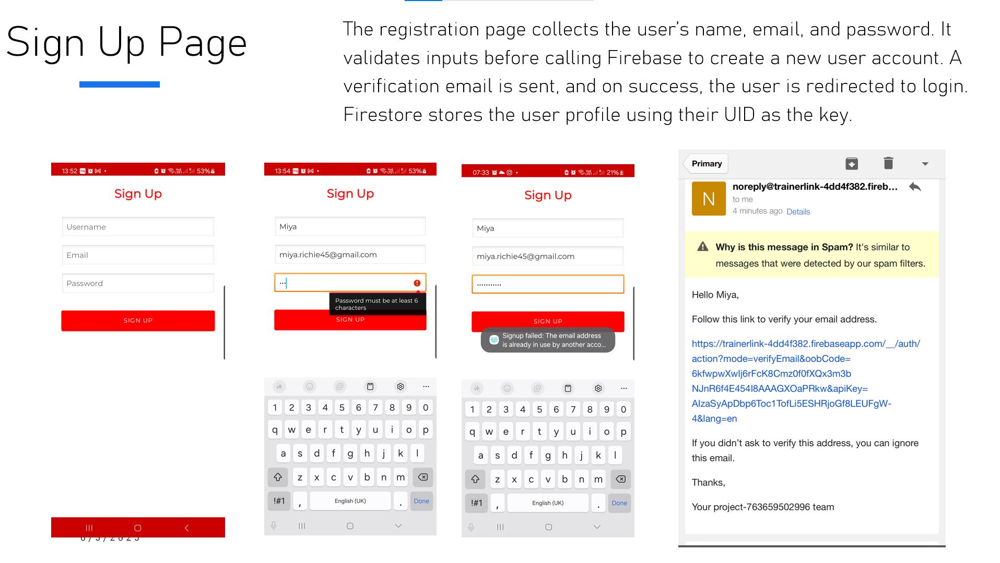
  

<b>Login Screen</b> 
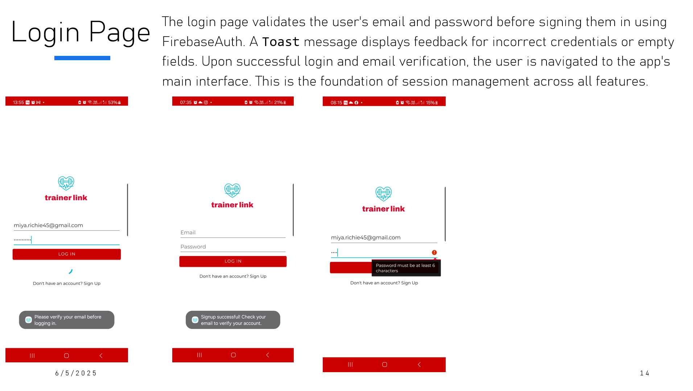
  

<b> Home Page</b> 
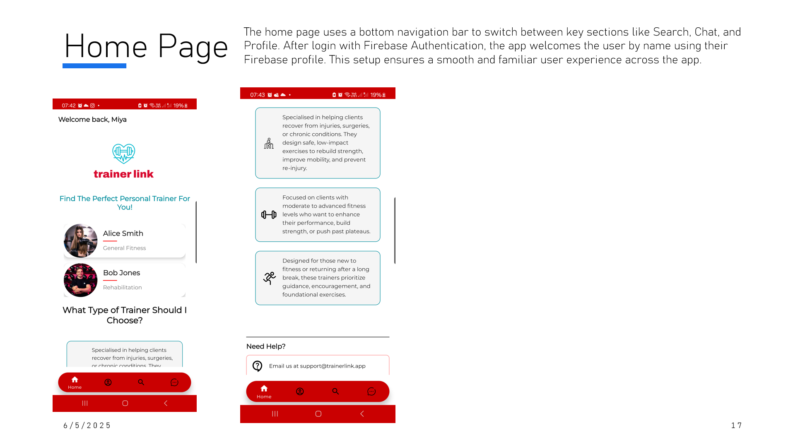
  

<b>Search Trainers Page</b> 
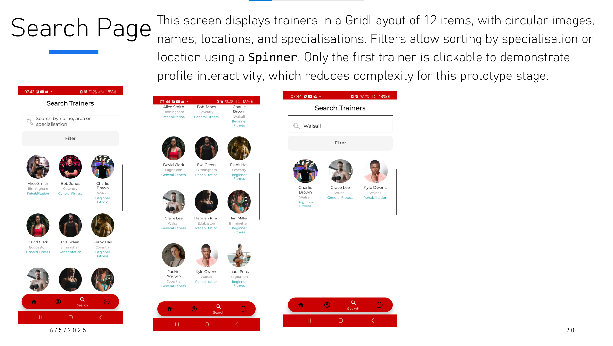
  

<b>Trainer Profile</b> 
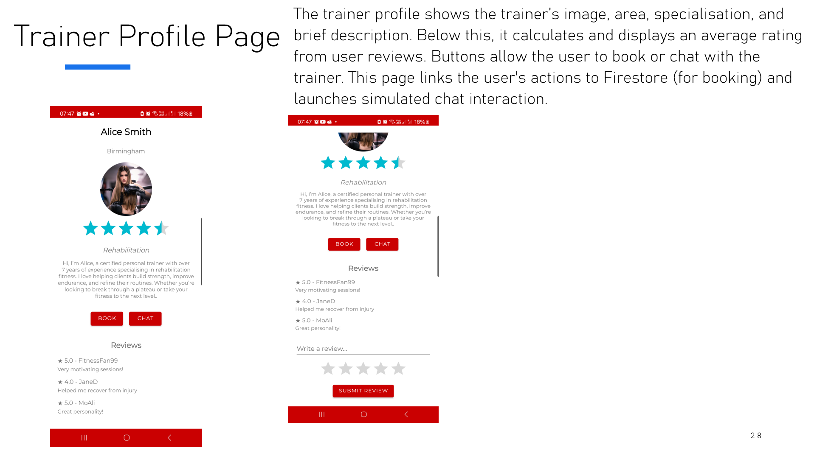
  

<b>Booking Calendar</b> 
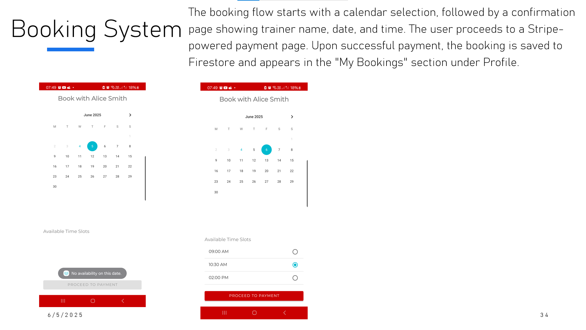
  

<b>Payment Screen</b> 
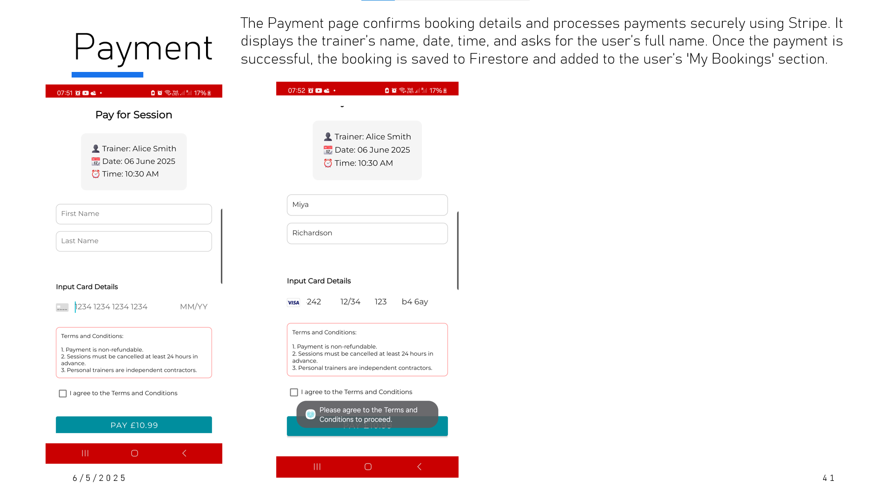
  

<b>Payment Success Screen</b> 
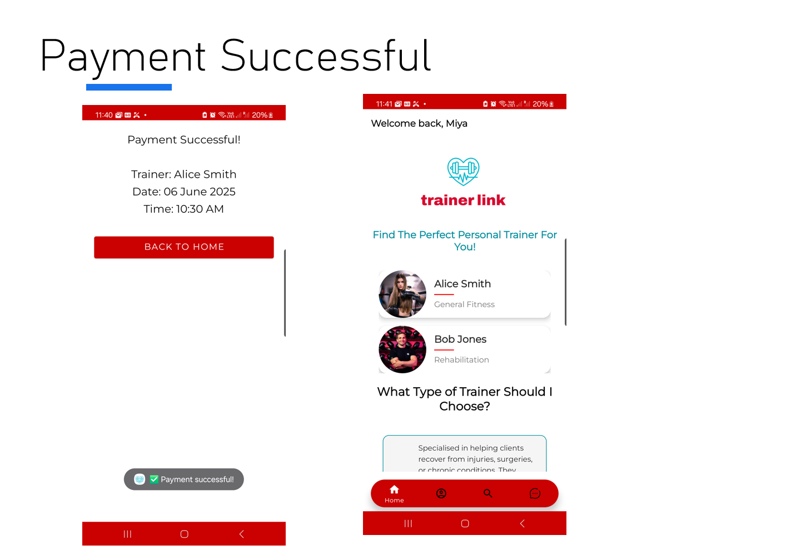
  

<b>Chat Page</b> 
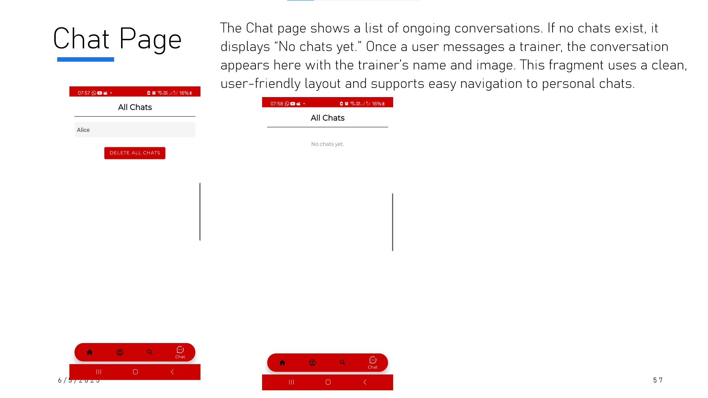
  

<b>Chat Conversation</b> 
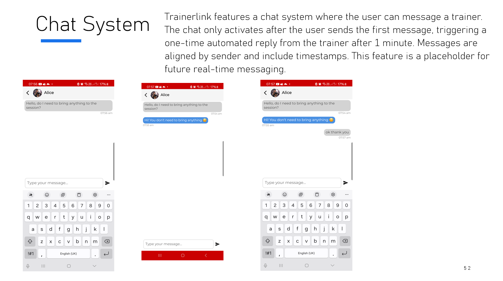
  

<b>Profile and Bookings</b> 
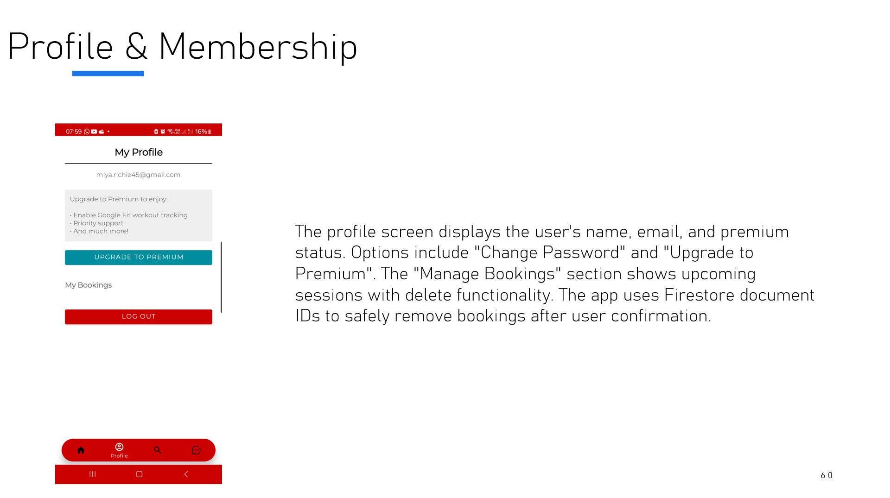
  

<b>Upgrade Membership</b> 
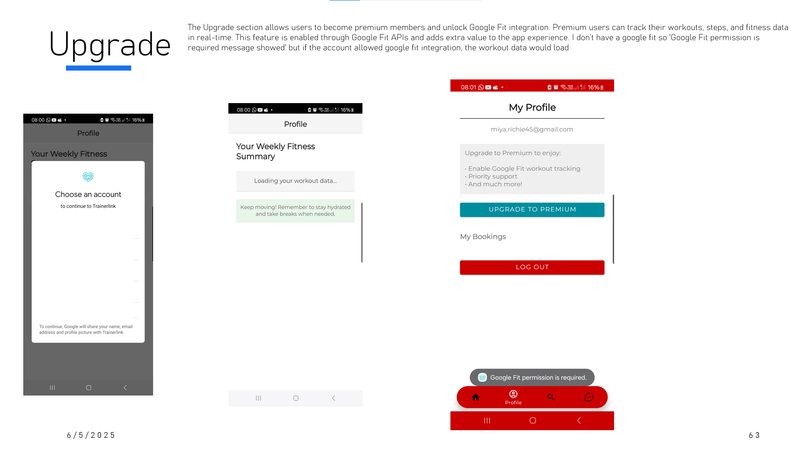
  

